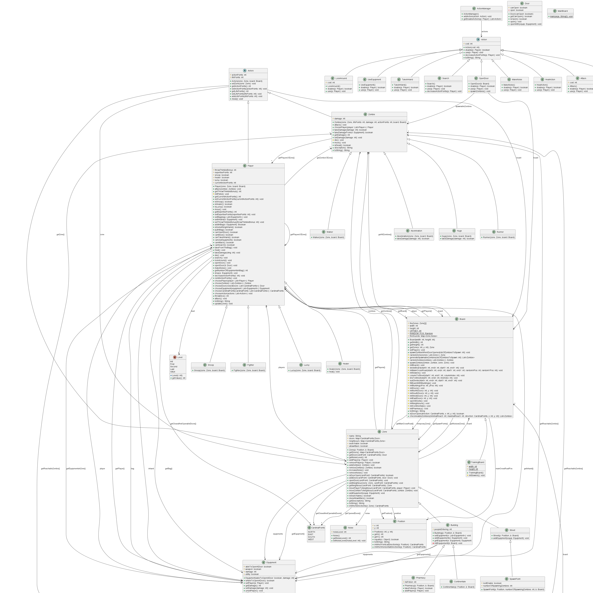

# l2s4-projet-2024

### Sommaire 

**Les livrables :**

- [Livrable 1](#livrable-1)

- [Livrable 2](#livrable-2)

- [Livrable 3](#livrable-3)

- [Livrable 4](#livrable-4)

**Le journal de bord :**

- [Semaine 1](#semaine-1)

- [Semaine 2](#semaine-2)

- [Semaine 3](#semaine-3)

- [Semaine 4](#semaine-4)

- [Semaine 5](#semaine-5)

- [Semaine 6](#semaine-6)

- [Semaine 7](#semaine-7)

- [Semaine 8](#semaine-8)

- [Semaine 9](#semaine-9)

- [Semaine 10](#semaine-10)

- [Semaine 11](#semaine-11)

- [Semaine 12](#semaine-12)

- [Semaine 13](#semaine-13)

# Equipe

- Elea KRZEWINSKI
- Cyril PROY
- Raphael LEVECQUE
- Guillaume PONSDESSERRE

# Sujet

[Le sujet 2024](https://www.fil.univ-lille.fr/~varre/portail/l2s4-projet/sujet2024.pdf)

# Livrables

## Livrable 1

- [Retour au sommaire principal](#sommaire)

### Sommaire livrable 1

- [Les commandes](#les-commandes-livrable-1)

- [L'état du développement](#létat-du-développement-livrable-1)

- [Les choix de modélisation](#les-choix-de-modélisation-livrable-1)


### Les commandes livrable 1

Concernant le nombre de commandes : nous pensons créer un paquetage parent à tous les autres pour réduire le nombre de commandes nécessaires à la compilation depuis le terminal.

**Compilation des sources :**  
```
javac -sourcepath src src/board/*.java -d classes
```

```
javac -sourcepath src src/actors/players/*.java -d classes
```

```
javac -sourcepath src src/livrable/*.java -d classes
```

**Génération de la JavaDoc :**  
```
javadoc -sourcepath src -subpackages board zone util actors actions equipments -d docs
```

**Compilation des test :**  
```
javac -classpath classes:junit-console.jar test/zone/*.java
```

```
javac -classpath "classes;junit-console.jar" test/zone/doors/*.java
```

```
javac -classpath classes:junit-console.jar test/util/*.java
```

**Exécution des tests :**  

```
java -jar junit-console.jar -classpath test:classes -scan-classpath
```

**Création du jar :**  

```
jar cvfe livrable1.jar livrable.Livrable1 -C classes board livrable
```

**Exécution du jar :**  

```
java -jar livrable1.jar <width> <height>
```

Avec width et height supérieur ou égale à 5. 

### Atteinte des objectifs

#### L'état du développement livrable 1

À l'heure actuelle nous pensons avoir développé tous les éléments requis pour le Livrable 1.

C'est à dire les classes permettant de représenter les différentes zones du plateau de jeu ainsi que le plateau en lui-même. Par ailleurs, nous avons aussi conçu et programmer l'algorithme de génération aléatoire du plateau de jeu. 

Nous avons commencé à nous intéresser plus profondèment à la modélisation des acteurs et des équipements. 

**UML :**


#### Les choix de modélisation livrable 1

Dans cette partie nous allons revenir sur la modélisation du plateau et de sa création qui sont éléments importants de ce premier Livrable. 

**Les cases formant le plateau :**

Tout d'abord, nous avons distingué les différentes de la manière qui nous semblait la plus approprié : une Zone contient des portes, des acteurs, un niveau de bruit, une position et un nom. On distingue ensuite deux classes qui héritent de Zone : Building qui représente une case pièce et Street qui représente une case rue. Building contient des équipements contrairement à Street.

Enfin, deux classes héritent de Building : Continentale et Pharmacy, dont le comportement sera à définir lors de la modélisation des actions. Puis, une classe SpawnPoint hérite de Street, elle sert à représenter les bouches d'égouts, qui serviront à faire apparaitre de nouveaux Zombies. 

**La génération du plateau :**

La génération du plateau est définit dans la méthode initBoard de ClassicalBoard. On y retrouve la division du plateau et l'initialisation des cases du plateau. 

On commence par diviser le plateau avec des rues, lors de la première division on retient la position du carrefour principal. Une fois la division termninée on positionne les cases "spéciales" : SpawnPoint, Continentale et Pharmacy (position déterminée aléatoirement pour ces deux cases). Une fois ceci fait, on remplit les cases vides avec des Building. 

Ensuite, une fois le plateau rempli on initialise les Door, nous avons fait attention à ce que deux pièces adjacentes partagent une **même instance* de Door lorsque que c'est nécessaire. Par exemple, prenons les coordonées (x,y), si deux pièces P1 et P2 se trouvent respectivement aux coordonnées (1,1) et (2,1) la porte EST de P1 sera la même instance que la porte OUEST de P2. Ceci vaut également pour les autres directions. 

Enfin nous terminons par ouvrir les portes des rues. 

### Difficultés restant à résoudre

Concernant la manière d'initialiser les portes nous aimerions éventuellement trouver une autre solution car cela nous mène à utiliser **instanceof** (qui est une mauvaise pratique de ce que nous avons compris) dans openStreets() de la classe ClassicalBoard.

## Livrable 2

- [Retour au sommaire principal](#sommaire)

### Sommaire livrable 2

- [Les commandes](#les-commandes-livrable-2)

- [L'état du développement](#létat-du-développement-livrable2)

- [Les choix de modélisation](#les-choix-de-modélisation-livrable-2)

- [Changements apportés](#changements-apportés-livrable-2)

### Les commandes livrable 2

Pour compiler les classes, les tests, les exécuter et pour générer la document et les livrables nous avons créé un Makefile, avec les commandes suivantes. 
Vous trouverez également les commandes java. 

#### Makefile 

**Compilation des sources :**  

```
make cls
```

**Génération de la JavaDoc :**

```
make docs
```

**Compilation et exécution des tests**

```
make test
```

**Génération des livrables**

```
make livrableX.jar
```

avec X le numéro du livrable. 

#### Java 

**Compilation des sources :**  
```
javac -sourcepath src src/zombicide/board/*.java \
src/zombicide/actions/*.java \
src/zombicide/actors/*.java \
src/zombicide/actors/zombie/*.java \
src/zombicide/actors/players/*.java \
src/zombicide/equipments/*.java \
src/zombicide/exception/*.java \
src/zombicide/livrable/*.java \
src/zombicide/util/*.java \
src/zombicide/zone/*.java \-d classes
```

**Génération de la JavaDoc :**  
```
javadoc -sourcepath src -subpackages zombicide -d docs
```

**Compilation des test :**  
```
javac -classpath classes:junit-console.jar test/zombicide/actors/players/*.java \
test/zombicide/actors/zombies/*.java \
test/zombicide/equipments/*.java \
test/zombicide/util/*.java \
test/zombicide/zone/*.java \
test/zombicide/zone/doors/*.java \
```

**Exécution des tests :**  

```
java -jar junit-console.jar -classpath test:classes -scan-classpath
```

**Création du jar :**  

```
jar cvfe jar/livrable2.jar zombicide.livrable.Livrable2 -C classes zombicide 
```

**Exécution du jar :**  

```
java -jar jar/livrable2.jar 
```

### Atteinte des objectifs

#### L'état du développement livrable2

A ce stade, nous avons réussi à modéliser et implémenter toutes les classes qui nous semblaient nécessaire pour les acteurs et équipements. Bien sûr, il est possible voire probable que nous serions amenés à apporter des modifications plus tard. 

Voici notre UML pour ce livrable 2 : 

Nous avons essayé de corriger les erreurs qui étaient remontées après le rendu du premier livrable. De plus, on a aussi conceptualisé les acteurs et equipements. 
**Toutefois**, il est à retenir que suite à un problème avec le logiciel utilisé pour créer l'UML (Lucid), nous sommes actuellement en train de recréer l'UML afin qu'il soit mieux organisé, plus complet, et qu'on ne soit pas contraint par la taille pour pouvoir représenter tous nos concepts. 


#### Les choix de modélisation livrable 2

Pour ce livrable nous devions nous concentrer sur les acteurs et les equipements. 

- Concernant les acteurs : 

 - **Actor** : Il nous semblait naturel de créer une classe Actor et de créer une classe Player (les survivants) et autre Zombie qui descendent de Actor car ces deux éléments possédent des éléments en commun. Ainsi nous évitons la répétition de code, il serait d'ailleurs peut-être intéressant de définir la méthode `takeDamage()` dans Actor au lieu de la réécrire dans Zombie et Player.  

 - **Player** : La classe player définit le comportement général des survivants, d'autres classes qui représente les différents rôles de survivant comme Fighter en héritent et redéfinissent leur propre comportement quand cela est nécessaire. Vous remarquerez pour certains rôles le comportement particulier n'a pas encore été défini car nous attendions modéliser les actions avant de réfléchir à comment implémenter leurs particularités. 

 - **Zombie** : A l'image de Player et ses différents rôles, Zombie définit le comportement général des Zombie et des classes filles comme Walker ou Runner. Les cas de Huge et Abomination redéfinissent notamment la méthode `takeDamage()` pour encaisser les dégâts de 1 point.

- Concernant les équipements : 

Parmi les équipements nous avons fait la distinction entre deux types principaux d'équipements : les Armes **Weapon** les soins **Heal** et le reste. 

 - **Equipment** : Classe parent qui défnit notamment si un équipement peut ouvrir une porte, son coût d'utilisation. Vous noterez également la présence de méthodes makeAChoice en fin de classe qui représente nos premières itérations sur l'implémentation des actions, donc ces méthodes sont susceptibles de changer. 

 - **Weapon** : Définit la valeur du dé nécessaire pour utiliser une arme, sa portée minimale et maximale, le nombre de fois qu'on lance le dé. Des classes filles comme Crowbar ou Rifle implémentent les différentes armes disponibles

 - **Heal** : Définit la valeur de soins lorsque cet équipement est utilisé. AidKit et BottleOfHealing en héritent. 

 - Concernant les autres équipements : Différentes classes comme Map ou MasterKey viennent implémenter le comportement des différents équipement restants. 


### Difficultés restant à résoudre

Vous avez peut-être remarqué la présence d'une classe Utilities dans les équipements, cette classe est vouée à être supprimée car nous nous sommes rendu compte qu'elle nous serait pas utile. 

Nous devons également faire en sorte que lorsque un joueur utilise une arme et/ou un équipement il perde des points d'actions : à gérer dans les actions ou dans les méthodes `use()` des équipements ? 

De même, pour le moment nous avons décidé que lorsque que nous avons plusieurs choix pour une action (par exemple ouvrir quelle porte ?) le choix se faisait aléatoirement dans la méthode `use()` de l'équipement utilisé. Mais il serait peut-être pertinent de faire cela autrement. 

Pour résumer, certains aspects des équipements sont nous semblent liées aux actions et c'est pourquoi il est possible qu'un certains nombre d'éléments présents actuellement soient changés au fur et à mesure que l'on avance dans la modélisation des actions. 

Enfin, un point sur lequel nous avons peut-être un peu de retard est le bruit.

### Changements apportés livrable 2

Pour gérer les mouvements nous avons été amenés à modifier la classe Zone. En effet, nous nous sommes dit qu'il serait intéressant que Zone ait connaissance de ces Zones voisinent afin de réaliser les déplacements des acteurs. 

## Livrable 3

- [Retour au sommaire principal](#sommaire)

### Sommaire livrable 3

- [Les commandes](#les-commandes-livrable-3)

- [L'état du développement](#létat-du-développement-livrable-3)

- [Les choix de modélisation](#les-choix-de-modélisation-livrable-3)

- [Changements apportés](#changements-apportés-livrable-3)

### Les commandes livrable 3

Pour compiler les classes, les tests, les exécuter et pour générer la document et les livrables nous avons créé un Makefile, avec les commandes suivantes. 
Vous trouverez également les commandes java. 

#### Makefile 

**Compilation des sources :**  

```
make cls
```

**Génération de la JavaDoc :**

```
make docs
```

**Compilation et exécution des tests**

```
make test
```

**Génération des livrables**

```
make livrableX.jar
```

avec X le numéro du livrable. 

#### Java 

**Compilation des sources :**  
```
javac -sourcepath src src/zombicide/board/*.java \
src/zombicide/actions/*.java \
src/zombicide/actors/*.java \
src/zombicide/actors/zombie/*.java \
src/zombicide/actors/players/*.java \
src/zombicide/equipments/*.java \
src/zombicide/exception/*.java \
src/zombicide/livrable/*.java \
src/zombicide/util/*.java \
src/zombicide/zone/*.java \
src/zombicide/zone/doors/*.java \
src/zombicide/listchooser/*.java \
src/zombicide/listchooser/util/*.java \
-d classes
```

**Génération de la JavaDoc :**  
```
javadoc -sourcepath src -subpackages zombicide -d docs
```

**Compilation des test :**  
```
javac -classpath classes:junit-console.jar test/zombicide/actors/players/*.java \
test/zombicide/actors/zombies/*.java \
test/zombicide/equipments/*.java \
test/zombicide/util/*.java \
test/zombicide/zone/*.java \
test/zombicide/zone/doors/*.java \
test/zombicide/actions/*.java \
```

**Exécution des tests :**  

```
java -jar junit-console.jar -classpath test:classes -scan-classpath
```

**Création du jar :**  

```
jar cvfe jar/livrable3.jar zombicide.livrable.Livrable3 -C classes zombicide 
```

**Exécution du jar :**  

```
java -jar jar/livrable3.jar 
```

### Atteinte des objectifs

#### L'état du développement livrable 3

A ce stade, nous avons implémenter tout ce qui nous semblait nécessaire à la modélisatio attendu du livrable 3, c'est-à-dire qu'en plus du plateau de jeu, des acteurs et équipements, nous avons désormais représenté les actions. 

Voici notre UML pour ce livrable 3 (UML en deux parties car le plugin proposé pour générer l'UML ne permettait pas de le représenter dans son entièreté) :




#### Les choix de modélisation livrable 3

Pour ce livrable nous devions nous concentrer sur les actions. 

Voici comment nous avons décidé de les représenter : 

* Nous avons d'abord décidé de créer une classe Action pour chaque action possible (par exemple Attack ou OpenDoor). Pour nous, une action devait : 

	* Définir une méthode `boolean doable(Player p)` pour savoir si l'action est réalisable par un joueur donné
	* Définir une méthode `void use(Player p)` pour lancer l'exécution et appeler la méthode `decreaseActionPoints(p)`
	* Définir une méthode `void decreaseActionPoints(Player p)` pour décrementer les points d'action d'un joueur selon l'action et le joueur

* Nous avons également crée une classe `ActionManager` qui disposera de la liste de toutes les actions possible dans une partie. Par le biais d'une méthode `List<Action> getDoableActions(Player p)` elle nous permettra de récupérer les action réalisable pour une joueur donné. 

* Nous avons également décidé de proposer à un joueur uniquement les action qu'il est capable de faire et si elle a une utilité. Par exemple, on ne lui propose pas d'ouvrir une porte si toutes les portes de la zone dans laquelle il se trouve sont déjà ouvertes. Il choisit ensuite aléatoirement une action dans la liste des actions qu'il peut réaliser. 

* Un joueur, lorsqu'il a plusieurs possibilités, choisit aléatoirement. Pour réaliser ce choix aléatoire nous avons utilisé le code RandomListChooser qui nous a été fourni. Grâce à ce code nous avons défini des méthodes du type `Zombie chooseZombie(List<Zombie> zombies)` pour choisir une direction, une porte, un joueur, un équipement. 

* Le comportement à proprement parlé des actions et généralement défini soit dans Player soit dans les équipements quand il s'agit de ce que nous avons appelé `Utilities` (fiole de soin, carte, etc). 

* Concernant l'affichage, actuellement l'affichage montre toutes les actions des zombies, ce qui peut vite prendre de la place s'il y en a beaucoup. Nous pensons à alléger cette affichage, par exemple en n'affichant rien si le zombie ne peut pas bouger ou attaquer. 


### Difficultés restant à résoudre

Améliorer l'affichage pour le rendre plus lisible et standardisé. 

### Changements apportés livrable 3

Nous avons apporté quelques modifications aux équipements, notamment en créant des méthodes `isWeapon()` et `isUtilities()`, nous avons également déplacé les choix aléatoire qui se font désormais au sein des classes `Zombie` et `Player`. 

De même, pour savoir si une action est faisable dans une zone donnée nous avons revu notre système en simplement créant des attributs et méthodes comme `isSearchable()` ou `doesAllowAttack()`

## Livrable 4

- [Retour au sommaire principal](#sommaire)

### Sommaire livrable 4

- [Les commandes](#les-commandes-livrable-4)

- [L'état du développement](#létat-du-développement-livrable-4)

- [Les choix de modélisation](#les-choix-de-modélisation-livrable-4)

- [Changements apportés](#changements-apportés-livrable-4)

### Les commandes livrable 4

#### Makefile 

**Compilation des sources :**  

```
make cls
```

**Génération de la JavaDoc :**

```
make docs
```

**Compilation et exécution des tests**

```
make test
```

**Génération des livrables**

```
make zombicide.jar
```

#### Java 

**Compilation des sources :**  
```
javac -sourcepath src src/zombicide/livrable/*.java -d classes
```

**Génération de la JavaDoc :**  
```
javadoc -sourcepath src -subpackages zombicide -d docs
```

**Compilation des test :**  
```
javac -classpath classes:junit-console.jar test/zombicide/actors/players/*.java \
test/zombicide/actors/zombies/*.java \
test/zombicide/equipments/*.java \
test/zombicide/util/*.java \
test/zombicide/zone/*.java \
test/zombicide/zone/doors/*.java \
test/zombicide/actions/*.java \
```

**Exécution des tests :**  

```
java -jar junit-console.jar -classpath test:classes -scan-classpath
```

**Création du jar :**  

```
jar cvfe jar/zombicide.jar zombicide.livrable.Zombicide -C classes zombicide 
```

**Exécution du jar :**  

```
java -jar jar/zombicide.jar <width> <height> <nbPlayers>
```

### Atteinte des objectifs

#### L'état du développement livrable 4

Nous avons réussi à atteindre l'objectif, qui était d'avoir une version jouable automatiquement sans erreur et qui respecte les règles fournies en début de semestre. 

Voici l'UML de cette version finale :


#### Les choix de modélisation livrable 4

Nous avons simplement décidé de créer une classe `Game` qui :

* Dispose d'un plateau de jeu `board`

* Dispose d'un `actionManager`

* Initialise un `TrainingBoard` si et seulement si la largeur et la hauteur du plateau sont respectivements égales à 5

* Ajoute des joueurs dont leur rôle est déterminé aléatoirement

* Initialise les action et les premiers zombies

* Déroule une partie du jeu 

* Vérifie si la partie est terminée lors de chaque tour (tour des survivants et tour des zombies), et également après chaque action (action des survivants et zombie)

### Difficultés restant à résoudre

Il nous semble qu'il n'y a pas de réelles difficultés à résoudre, en revanche on pourrait améliorer certains aspects du jeu. 

Par exemple, on pourrait faire en sorte de rendre les survivants plus intelligents en les forçant à attaquer lorsque c'est possible. Car actuellement ils attaquent peu, ce qui amène très souvent à des défaites. 

### Changements apportés livrable 4

Nous avons corrigé quelques aspects qui pouvaient causer des erreur ou rendre plus compliquer certaines méthodes. En revanche il n'y a pas eu de changements majeurs. On peut éventuellement noter la suppression de `Zone` dans le constructeur des acteurs. 

# Journal de bord

- [Retour au sommaire principal](#sommaire)

## Semaine 1

- Lors de la séance du 15/01 :

Nous avons commencé à créer le diagramme UML, en particulier ce qui concerne les entités relatives au plateau de jeu. 

- Au cours de la semaine du (1) 15/01 :

De manière individuelle, approfondissement du diagramme UML, notamment ce qui concerne les attributs et méthodes des entités. 
Ainsi, nous mettrons en commun nos diverses idées lors de la séance prochaine afin de déterminer la meilleure façon de modéliser le plateau de jeu avant de commencer à programmer. 

## Semaine 2

- Lors de la séance du 22/01 :

Nous avons avancé sur le diagramme UML, nous avons commencé à coder les classes pour le premier livrable.


- Au cours de la semaine du (2) 22/01 :

Nous nous sommes répartis le travail pour coder les classes modélisant le plateau de jeu. Il reste encore des méthodes et des test à écrire. 

Nous devons également mettre à jour plusieurs éléments du diagramme UML

Réflexion individuelle concernant l'algorithme de génération de plateau avant de mettre en commun nos pistes lors de la prochaine. 

- Pour la prochaine semaine (3) :

Programmer les dernière méthodes et tests nécessaire à la modélisation du plateau et avancer sur l'algorithme de génération de plateau, notamment la division en rues et batiments.

## Semaine 3

- Lors de la séance du 29/01 :

Nous avons réfléchi et avancé sur l'algorithme de division du plateau, de même pour l'affichage du plateau.

- Concernant les issues #3, #4 et #2 :

On a choisi de faire une classe SpawnPoint pour l'affichage de notre plateau.  

On a decidé de faire des listes d'actions dans les zones pour savoir quelles actions sont possibles dans la zone en question, notamment pour le Continentale où attaquer n'est pas autorisé.  

On crée des classes Zombie et Player différentes pour l'instant, pour gérer les différents tours en fonction du type. On pense peut-être rajouter une classe Actor dans le futur dont Zombie et Player hériteraient.  
  
- Au cours de la semaine du 29/01 :  

On a implementé notre algorithme de création du plateau (division aléatoire, remplissage, placement aléatoire du continental et de la pharmacie) et nous avons continué d'avancer sur son affichage.  

Nous avons fixer plusieurs issues.On a enlever les methode getXXXXZone()  

-  Pour la prochaine semaine :  

Fixer les issues restantes, corriger et mettre à jour le diagramme UML, finaliser l'affichage du plateau, et vérifications avant le premier livrable. 

-  Explication code  toString de board
  ```java
  public String toString() {
		String ret = "";
        // Boucle for pour acceder à chaque ligne.
		for(int i =0; i<this.height; i++){
			int cmpt =0;
            // La fonction Zone.toString() renvoie la description en String d'une zone. Cette description est sur une seul ligne. Or à l'affichage on a besoin de mettre cette zone sur trois lignes. C'est pour cela que l'on fait un for trois.
			for(int o = 0; o<3; o++) {
                // Boucle for pour accéder a chaque colonne.s
				for(int j =0; j<this.width; j++){
                    //Renvoie la premiere, deuxieme ou troisieme ligne de zone.toString() suivant les paramétres de la deuxieme boucle for, et le compteur.
					ret += theZones[j][i].toString().substring(cmpt, cmpt+4);
					if(cmpt ==0 && j == this.width -1) {
						ret+="———";
					}
				}
				cmpt +=4;
			ret += "｜";
			ret += "\n";
			}
		}
		for(int q = 0; q<this.width; q++) {
			ret+= "—————";
		}
		return ret;
	}
```


## Semaine 4 

- Lors de la séance du 05/02 :

Nous avons commencé à terminer ce qu'il nous semblait primordial pour le livrable 1, c'est-à-dire la génération du plateau ainsi que son affichage. 

Dans le même temps, nous avons commencé à approfondir notre réflexion quant aux éléments nécessaires à la modélisation des acteurs. 

- Au cours de la semaine du 05/02 :

Accent mis sur le dépôt du livrable 1. 

## Semaine 5

- Lors de la séance du 12/02 : 

Prise de connaissance des premiers retour après le livrable 1. Nous avons notamment retenu les éléments suivants : Corriger les violations de la loi de Demeter, décomposer la création du carrefour, supprimer les tests inutiles, attention aux flèches uml, revoir l'héritage du TrainingBoard.  

Correction d'une partie de ces problèmes, et progression sur la modélisation des acteurs et des équipements

- Lors de la semaine du 12/02 : 

Correction des problèmes restants après le livrable 1.


## Semaine 6

- Lors de la séance du 19/02 : 

Nous avons continué à avancer sur l'implémentation des équipements, et avons également commencé à réfléchir à comment nous allons pouvoir modéliser les différentes actions. 

Réflexion autour des déplacements : une Zone doit-elle avoir connaissance de ses Zone voisines ?

- Lors de la semaine du 19/02 : 

Ajout de javadoc dans différentes classes, corrections/mises à jour de certains équipements, ajout des voisins à une Zone et donc initialisation des voisins. 

## Semaine 7

- Lors de la semaine du 26/02 :

Nous avons un peu avancé sur notamment les voisins des zones


## Semaine 8

- Lors de la semaine du 04/03 :

Accent mis sur le livrable 2 :

- Création du paquetage parent appelé zombicide
- Création du Makefile avec les commandes de compilation des classes, compilation et exécution des tests, création des livrables 1 et 2, génération de la documentation 
- Mise à jour de l'UML
- Création d'un main pour le livrable 2
- Nettoyage du dépôt git : création d'un dossier pour les livrables, un dossier pour les uml
- Correction d'erreurs liées au mouvements et à l'initialisation des voisins de chaque Zone
- Ajout de javadoc manquante

  

## Semaine 9

- Lors de la séance du 11/03

Nous nous sommes concentrés sur les issues suivantes : 

- #20 : le constructeur est bien au debut de la classe
- #19 : erreur lors du push, voir ligne 250 à 320 dans Board. Décomposition de initDoors en initXXXXDoor avec XXXX parmi North, South, West et East
- #18 : (Dans les fichiers Zombie et Player) création d'une méthode die() qui enlève le Zombie/Player de sa Zone. Cette méthode est appelée lorsque les points de vie du Zombie/Player tombent en dessous de 1
- #17 : on a ajouté des methodes use pour les equipments, qui permet de les utiliser et ensuite ajouter une methode use dans player 
- #15 : 

  

- Lors de la semaine du 11/03 : 

Quelques réflexions sur les actions.


## Semaine 10

- Lors de la séance du 18/03 : 

Première modélisation des actions et début d'implémentation. 

## Semaine 11

- Lors de la séance du 27/03 :

Révision de la modélisation des actions, déplacement des méthodes de choix aléatoire dans la classe Player, définition du comportement des action dans la classe Player.
Les action s'occupent désormais seulement de vérifier que le joueur est capable de réaliser l'action, de lancer l'exécution de l'action en question, d'appliquer le coût d'utilisation, et éventuellement d'appliquer un comportement secondaire de l'action (e.g. l'apparition de Zombie lorsque l'on ouvre un porte)


## Semaine 12

- Lors de la séance du 02/04 : 

Nous avons continué d'implémenter la nouvelle modélisation des actions. Compléter de la documentation et des tests. 

## Semaine 13

- Lors de la séance du 08/04 : 

Nous avons continué d'implémenter la nouvelle modélisation des actions. Compléter de la documentation et des tests.

## Semaines restantes 

- Entre le 08/04 et le 06/05 : 

Nous créer une classe Game qui représente une partie du jeu. Elle reprend donc tout le travail que nous avons fait jusqu'à présent. 

Nous avons également chercher et corriger des éléments qui pouvaient causer des erreurs. 

Nous avons complété la documentation.

Enfin, nous avons créer le dernier `main` qui exécute une partie en fonction de certains paramètres. 
